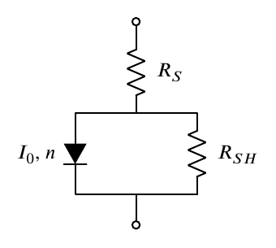

# <NAME> #

<FULLNAME>

Initial attempt at fitting diode using simple model:

This was created quickly for a project. A more general application to follow.

## Dependencies ##
* [SAMIS](http://github.org/agrede/SAMIS) functions (included):
  + `dydx.m` calculating derivatives from spline parameters
  + `physC.m` physical constants from [NIST](http://physics.nist.gov/cuu/Constants/)
* [JSONLAB](http://iso2mesh.sourceforge.net/cgi-bin/index.cgi?jsonlab)
* For reading and writing XSL files:
  + [Perl 5](http://perl.org)
  + Perl packages:
    - [JSON](http://search.cpan.org/dist/JSON)
    - [Spreadsheet::ParseExcel](http://search.cpan.org/dist/Spreadsheet-ParseExcel/)
    - [Spreadsheet::WriteExcel](http://search.cpan.org/dist/Spreadsheet-WriteExcel/)
* For making LaTeX plots:
  + LaTeX distribution (I use [TeX Live](https://www.tug.org/texlive/doc.html)
  + Packages:
    - [pgfplots](http://www.ctan.org/pkg/pgfplots)
    - [beamer](http://www.ctan.org/pkg/beamer)

## Note ##
This is for a very specific project. While it can be adapted for more general applications, it is not intended as a finished product.
